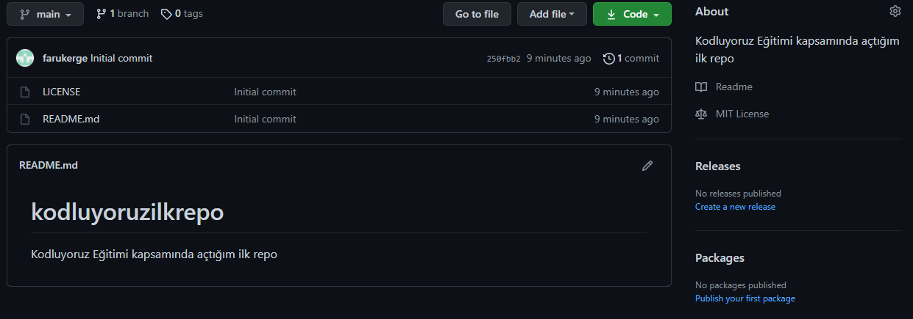

## Kodluyoruz İlk Repo

---

## Installation

---

Önceki projeyi klonlayın (https://github.com/farukerge/kodluyoruzilkrepo.git)

` git clone https://github.com/farukerge/kodluyoruzilkrepo.git`

## Usage

---

Projeyi cloneladıktan sonra Visual Stdio Code programında açınız.

Linux için:

`cd kodluyoruzilkrepo code .`

## Contribution

Pull requestler kabul edilir. Büyük değişiklikler için, lütfen önce neyi değiştirmek istediğinizi tartışmak için konu açınız.

## License

[MIT](https://choosealicense.com/licenses/mit/)
